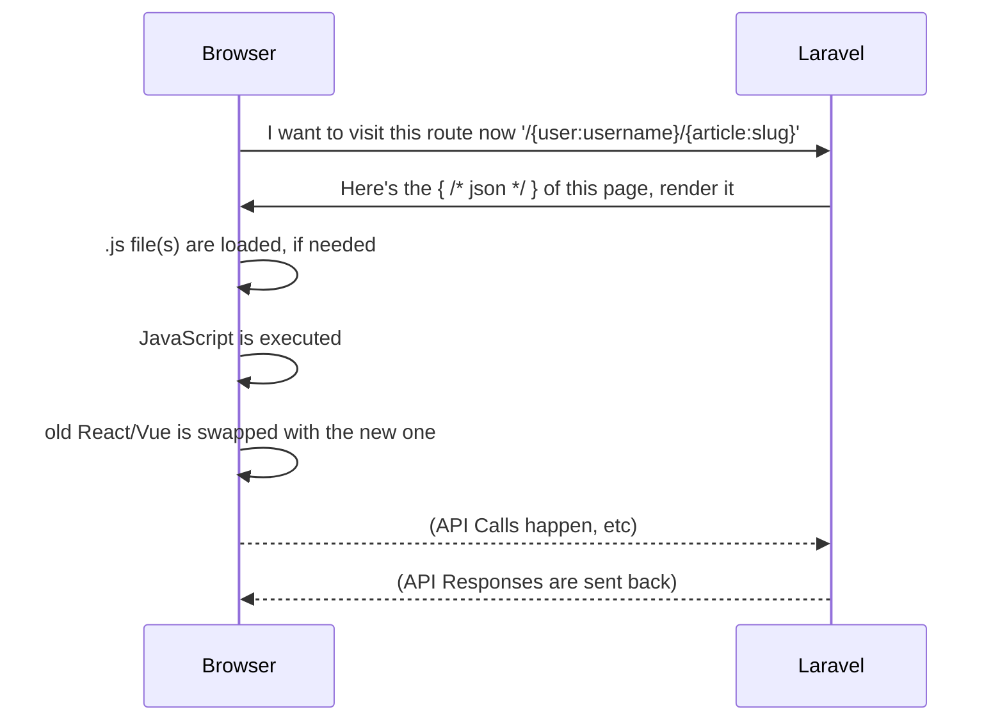

```mermaid
sequenceDiagram
    Browser->>Laravel: I want to visit this route now '/{user:username}/{article:slug}'
    Laravel->>Browser: Here's the { /* json */ } of this page, render it

    Browser->>Browser: .js file(s) are loaded, if needed
    Browser->>Browser: JavaScript is executed
    Browser->>Browser: old React/Vue is swapped with the new one

    Browser-->>Laravel: (API Calls happen, etc)
    Laravel-->>Browser: (API Responses are sent back)
```