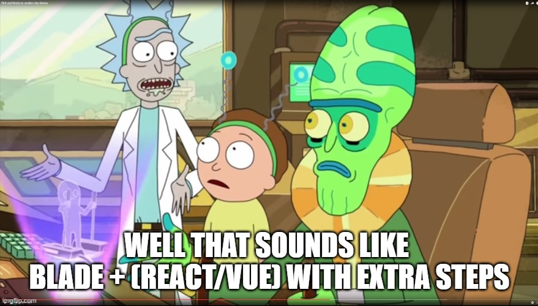

# Laravext

## What is it Laravext?

Laravext is a set of tools aimed to assist the development of [Laravel](https://laravel.com/) applications with [React](https://react.dev/) or [Vue](https://vuejs.org/). It's name is (just in case you didn't get it) a mix of Laravel and [Next.js](https://nextjs.org/), although not affiliated or endorsed by any of them. I tried to fit in something that also sounded like "Vue" or "[Inertia.js](https://inertiajs.com/)" in the name, but "Laravext" sounded the better, of all the options I thought of. Not that creative, I know. Sue me (just kidding, don't).

You may think of it as a Next.js' file based router inside your Laravel project, and something similar to [Blade Components](https://laravel.com/docs/11.x/blade#components) that is actually a React/Vue component. There're some methods that slightly remember Inertia.js as well



<sup>**Credits: Rick and Morty - Adult Swim**<sub>

Well, yes... Moving on.

### What is it not?

It's not a server-side renderer of any React/Vue component, as it'd require some kind of javascript engine for it, and I wanted simplicity. It's not an (out-of-the-box) SPA like Inertia, as for every new page you want to load, a new visit will be made... that being said, nothing stops you from using a traditional react router insde the `@nexus` directive (explained later), although I think that would look a bit peculiar, and would defeat the purpose of having the automatic file-based router. But hey, you do you.

### In case you want to help me...

[](https://www.buymeacoffee.com/arthurydalgo)

## Why does it exist?

First things first: I don't claim that this is supposed to replace or be better then Next.js/Inertia.js, as each project may have different kind of needs and it's team might have it's preference, and maybe just using blade files with [Laravel Folio](https://laravel.com/docs/10.x/folio) to automagically create routes from them could be enough for you, or maybe the [TALL](https://tallstack.dev/) stack is the right choice for you.

I wanted to get what I (personally) considered the best parts of Inertia.js and Next.js, and put them together. This was going to be inside a project of mine, but then I realized I could actually try to make a package for other people to use, and I would try to learn something along the way about how to build composer and npm packages.

Additionally, you might be asking yourself:

"Why don't you use Next.js?", or even "Why don't you use Inertia.js?"


Before somebody light up their torches or grab their forks: the following points are my opinion only, based on my personal (in)experiences and troubles. You may disagree with them, and that's fine. Feel free to skip this section.

Inertia.js offers server-side rendering of React/Vue pages, but it requires that you keep a `php artisan inertia:start-ssr` artisan command running through supervisor or something similar, which may not be available in a shared environment. You also don't have an out-of-the-box file-based routing system like the one Next.js offers. (To the best of my knoledge, at the time of writting)

Next.js offers server-side rendering of React components, and a great routing system, but I (personally) don't like their caching strategy, and for my use cases there was the need to slap a `"use client"` for nearly all pages. I felt a really degraded developer experience while using it, so for me became a no-no. I have other points about it, but I feel that the ["Why I Won't Use Next.js" article](https://www.epicweb.dev/why-i-wont-use-nextjs) from Kent C. Dodds summarizes most of what I mean way better than I could. It's a good reading if you're interested. 

But, once again, I don't want to trash talk Next.js, or Inertia or any other tool. You should use whatever makes you more productive and pays your bills, and in the end, quoting Kent:

"Whatever you use is probably fine.

Your tool choice matters much less than your skill at using the tool to accomplish your desired outcome (a great user experience)."

## What does it do?

As mentioned before, Laravext takes a lot of inspiration in how Next.js do things.

Laravext offers a way to automagically create routes based on the file structure of the `resources/js/nexus` (this location is customizable) directory, much like Next.js.

Using the following structure (the example uses .jsx files, but you may also use it with .vue files):

```
# In a Laravel project
+ resources/js/nexus

  - page.jsx # your-domain.com/

  + catalog
    - page.jsx # /catalog
    + {slug}
      - page.jsx # /catalog/{slug}
  
  + cart
    - page.jsx # /cart
    + checkout
      - middleware.jsx
      - page.jsx # /cart/checkout
  
  + (guest)
    - middleware.jsx
    - layout.jsx
    + login
      - page.jsx # /login
    + register
      - page.jsx # /register
  
  + (auth)
    - middleware.jsx
    + (author)
      - layout.jsx
      - middleware.jsx
      + books
        - page.jsx # /books
        + create
          - page.jsx # /books/create
        + {book}
          - page.jsx # /books/{book}
          + edit
            - page.jsx # /books/{book}/edit
      + orders
        - page.jsx # /orders
        + {order}
          - page.jsx # /orders/{order}

    + (reader)
      - layout.jsx
      - middleware.jsx
      + library
        - page.jsx # /library
        + {slug}
          - page.jsx # /library/{slug}
    ...
    # The rest of your pages
```

and inserting the following inside the `routes/web.php`:

```php
Route::laravext();
```

Automagically registers the routes of your application (the resulting URIs are displayed next to each page.jsx as example). [Next.js's file conventions](https://nextjs.org/docs/app/building-your-application/routing#file-conventions) can also be applied, such as middlewares, layouts, loading, error, etc. You can have granular control about what happens before a route is rendered, if needed (check the []() documentation section for more details).

A blade view (either the default one set in the config or specified one when the `Route::laravext()` is called and a `root_view` parameter is sent) is then rendered by the blade template engine. This view must contain what is called a `@nexus` blade directive, where the react component will be rendered. There're other ways render a nexus that are covered in the [here](#to-be-added).

Additionally, in case you have components that are common to multiple pages, such as navbars, you can use the `@strand('Path/To/NavBar')` directive alongside a `@nexus`, which will use the name as a path to find a react component inside the `resources/js/strands` (which is customizable). The previous example would load a `NavBar.jsx` from the `resources/js/strands/Path/To` directory.

Here's an example to how you could use it in a `app.blade.php` file:

```blade
<x-guest-layout>

    @strand('NavBar', ['some' => 'data'])

    ...

    @nexus

</x-guest-layout>
```

The NavBar component will be rendered and receive the props sent to it in the directive.

## Legal Disclaimer

This project has no financial intent, and is meerly a Frankenstein of Inertia.js and Next.js. I fully disclose that it may contain code that is straight up ~~copied from~~ inspired by the [inertia](https://github.com/inertiajs/inertia/) and [inertia-laravel](https://github.com/inertiajs/inertia-laravel) repos ~~, and changed to fit my needs~~.

I'm not responsible for anything you do with this code. I might stop supporting this at any given time, so please be aware of that before using it for anything that might be too important to you.

This section is just so I don't get my ass sued by anyone.

## Final Thoughts

This is my first "big" project aimed to be used by the community, and it's just a side project. This repo may contain flaws/bad choices (but who doesn't), or code that may cringe the hell out of you. Use it if you like, ignore it if you hate it.

PRs are welcome, but I may ignore them at my disclosure.

But hey, this is open-source, so you have my blessing (not that you need it anyway) to fork it and to do whatever the hell you want with it.
