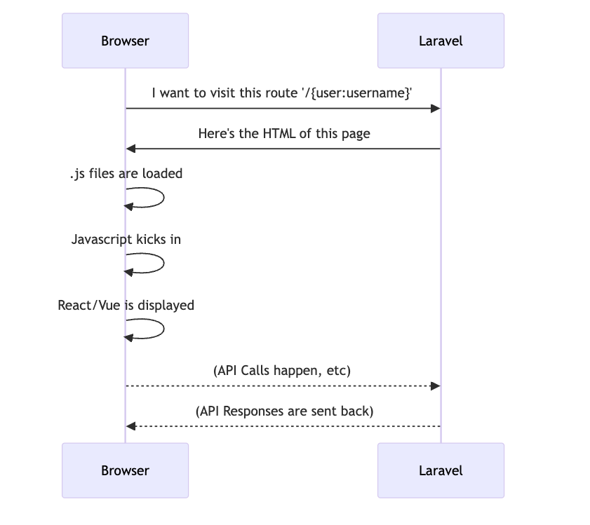
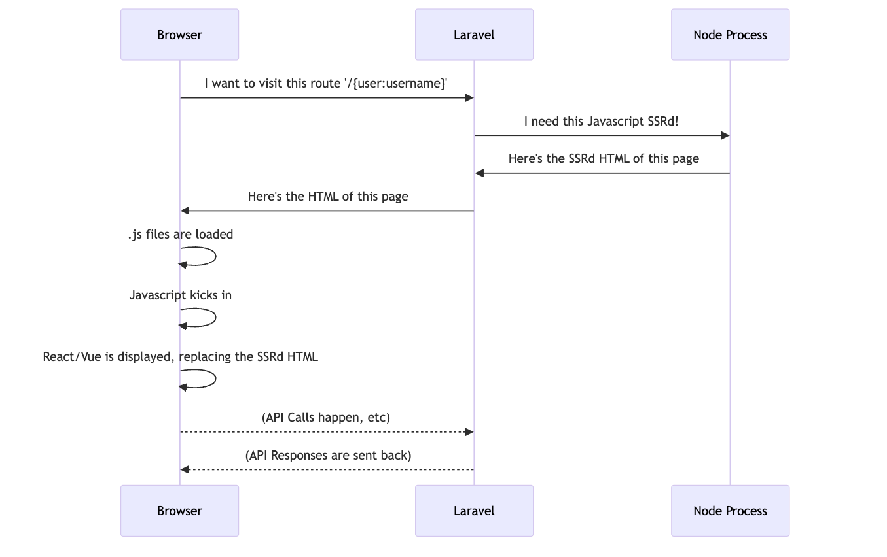
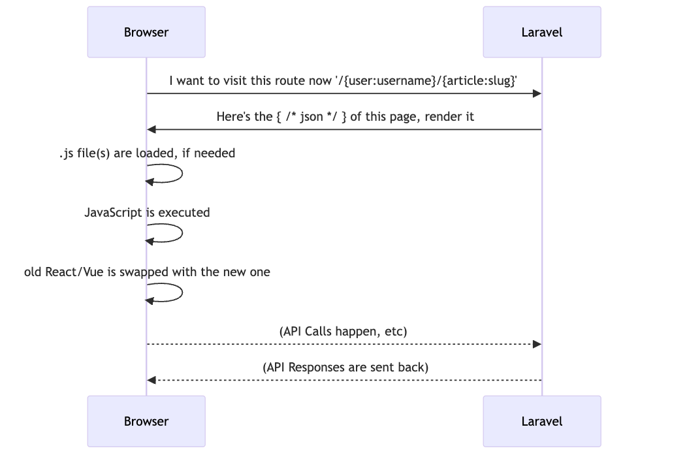
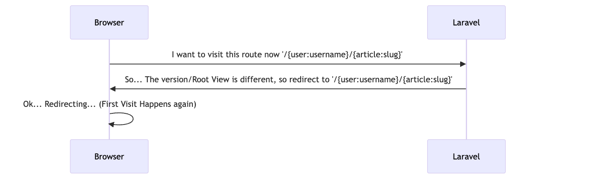

# Laravext Lifecycle

This section will explain how the lifecycle of a Laravel application using Laravext works.

## First Visit

This is the first visit to your application, and it can be divided into two scenarios: with and without Javascript Runtime SSR. Laravel will return a blade view that contains a `@nexus`/`@[start/end]Nexus`/`@strand`/`@[start/end]Strand` directive, which will be replaced by that URI's component.

### First Visit without Javascript Runtime SSR

### First Visit with Javascript Runtime SSR

In this case, before Laravel returns the HTML, it will make use of a Node Process to render the page and the React/Vue components, for user experience and SEO purposes.

## Subsequent Visits

After the first visit, whenever a user navigates to another page through the [visit function](/tools/visit) (which cointains headers to indicate that it's a visit request, with the current version and blade view), the response will be a json telling the client either the new component that it should render, or that it's supposed to do a page visit, either because the version is outdated or because the blade view is a different one.

### Render

### Redirect

**Note:** In case you're curious, these diagrams were made with Mermaid, and are available at the [Laravext Repository, in docs/images/network-diagrams](https://github.com/ArthurYdalgo/laravext/tree/main/docs/images/network-diagrams)