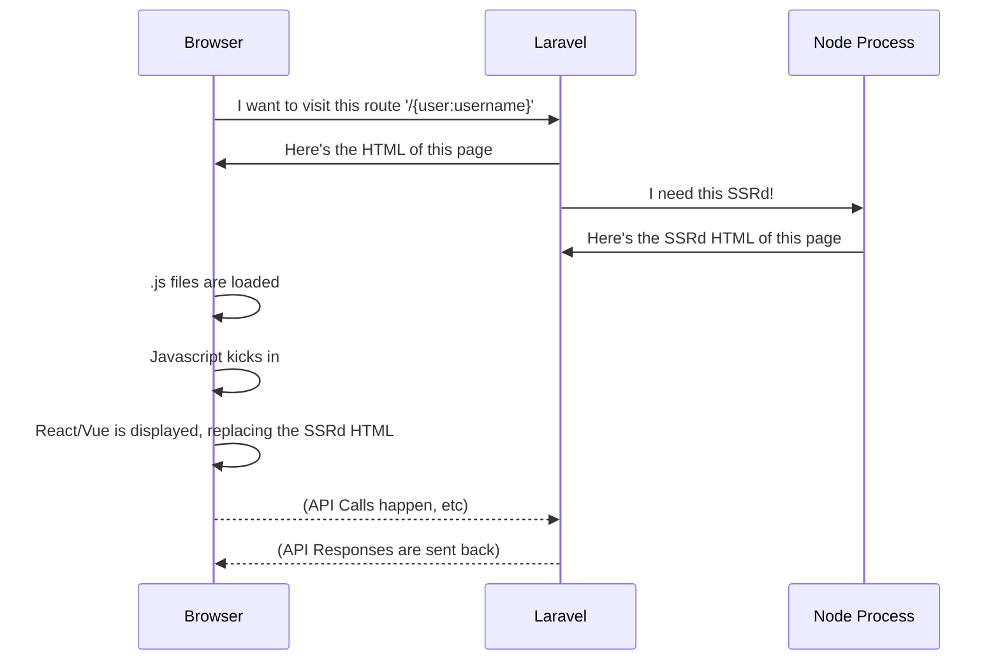

```mermaid
sequenceDiagram
    Browser->>Laravel: I want to visit this route '/{user:username}'
    Laravel->>Browser: Here's the HTML of this page

    Laravel->>Node Process: I need this SSRd!
    Node Process->>Laravel: Here's the SSRd HTML of this page

    Browser->>Browser: .js files are loaded
    Browser->>Browser: Javascript kicks in
    Browser->>Browser: React/Vue is displayed, replacing the SSRd HTML

    Browser-->>Laravel: (API Calls happen, etc)
    Laravel-->>Browser: (API Responses are sent back)
```