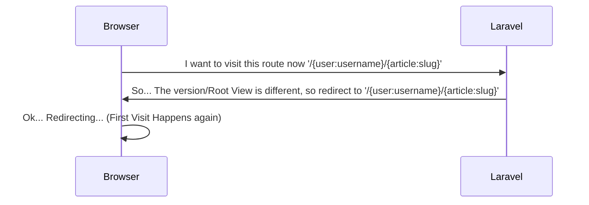

```mermaid
sequenceDiagram
    Browser->>Laravel: I want to visit this route now '/{user:username}/{article:slug}'
    Laravel->>Browser: So... The version/Root View is different, so redirect to '/{user:username}/{article:slug}'

    Browser->>Browser: Ok... Redirecting... (First Visit Happens again)
```