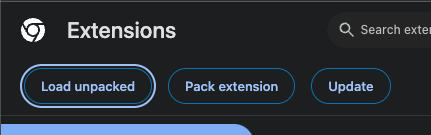
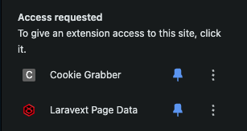
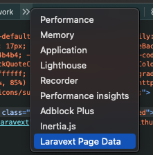
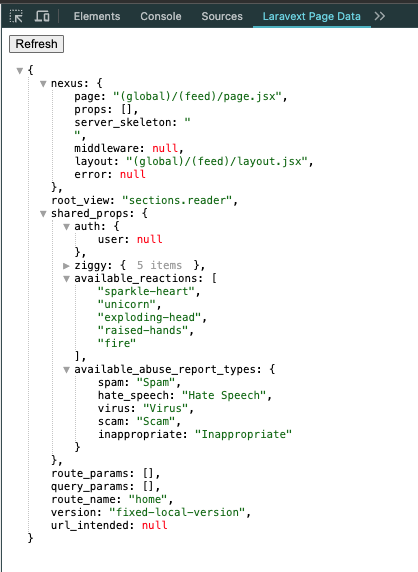

# Chrome Extension

Similar to the [Inertia.js devtools](https://chromewebstore.google.com/detail/inertiajs-devtools/golilfffgehhabacoaoilfgjelagablo?hl=en), there's also a Chrome extension that can be used to debug the data that is being passed to the client.

It displayed the content of the `__laravext.page_data` variable for debugging purposes. The extension is available in the [chrome-extension directory](https://github.com/ArthurYdalgo/laravext/tree/main/chrome-extension) of the Laravext Repository.

To install it, go to `chrome://extensions/`, enable Developer mode, click on Load unpacked and select the `devtools-extension` folder.

After that, you might need to click on the extension to grant it permissions to access the page data. 

Then open your developer tools and you should see a new tab called "Laravext Page Data" (you might need to click in the `>>` to see it).

Then just click refresh every time you want to see the updated page data.

If you want to remove anything from the displayed data to prevent it from being too bloated (like, let's say, ziggy routes), you can delete it from the evaluated result at the `panel.js` file. There's a commented example there.